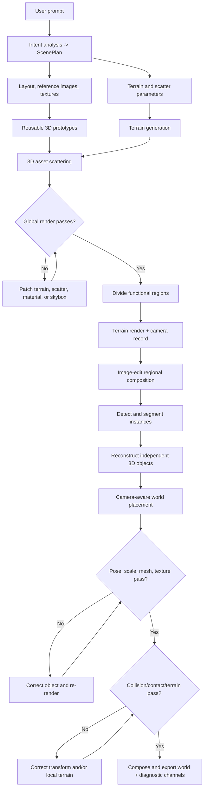

# WorldClaw Reproduction Plan

Status: implementation-ready plan based on arXiv v1 (2608.05248), reviewed 2026-08-12.

Primary source: [WorldClaw: Agentic 3D Open-World Generation at Scale](papers/WorldClaw-Agentic-3D-Open-World-Generation-at-Scale-v1.pdf)

Official project page: <https://tencent-hunyuan.github.io/Hunyuan3D-WorldClaw/>

Official repository: <https://github.com/Tencent-Hunyuan/Hunyuan3D-WorldClaw>

## 1. Executive assessment

WorldClaw is a multi-stage scene-construction system, not a single trained model. Its central contribution is the contract between a globally coherent semantic terrain and selectively generated local object instances:

1. Convert an open-ended prompt into a structured scene specification.
2. Construct a region-aware global height field, materials, and scattered terrain assets.
3. Render selected terrain regions and edit those renders into object-rich composition images.
4. Segment and reconstruct each inserted object independently.
5. Recover each object's world-space pose and scale using recorded camera geometry.
6. Iteratively refine object quality, object pose, terrain appearance, and object-terrain contact.

The official GitHub `main` branch contains only the paper overview. The `web` branch is a static React/Vite project page with rendered media; it does not contain the generation pipeline. A functional reproduction must therefore be independently implemented.

### What can and cannot be reproduced

- **Functional reproduction:** feasible. We can reproduce the architecture, intermediate representations, terrain equation, camera-aware placement, explicit asset representation, and render-inspect-refine loop.
- **Exact visual reproduction:** not currently possible from public material. The paper omits prompts, schemas, agent instructions, numerical constants, model snapshots for every provider, procedural operator implementations, and refinement thresholds.
- **Bitwise reproduction:** impossible without the authors' source code, complete configs, seeds, checkpoints, and generated intermediate artifacts.

The project should label every parameter as one of:

- `paper`: directly specified by the paper;
- `reproduction-default`: our documented starting value;
- `calibrated`: selected by an experiment and recorded with evidence.

### Critical technical analysis: claims that must be tested

The paper shows strong visual results, but it does not provide quantitative ablations, success rates, runtime, cost, agent traces, or evidence that every showcased world was produced without manual intervention. Its central claims must therefore be treated as hypotheses, not accepted conclusions.

| Paper claim or assumption | Why it may fail | Falsification experiment | Pass criterion |
|---|---|---|---|
| Smoothed semantic masks create coherent multi-biome terrain | Weighted height fields can blur boundaries, flatten intended cliffs, and create implausible intermediate landforms | Generate fixed two-, four-, and eight-region layouts using hard masks and several blend widths | Low boundary discontinuity without losing required region relief or topology |
| Equation 6 is expressive enough for open-world terrain | A height field is only 2.5D and cannot represent caves, arches, overhangs, or truly vertical cliffs | Reproduce island, canyon, dune, terrace, and mountain fixtures with known target profiles | Meets region elevation/slope/profile constraints; unsupported landforms are explicitly reported |
| An image editor preserves the rendered terrain and camera | Image editing may move silhouettes, change the field of view, or hallucinate support surfaces | Edit a render containing fiducials and compare terrain pixels/features, horizon, and camera calibration before/after | Terrain/camera drift below calibrated thresholds; otherwise the composition is rejected |
| `K_hat = A K_t` preserves crop geometry | Incorrect affine direction, pixel-center convention, or resize policy creates systematic ray error | Synthetic cube/sphere crops over varied aspect ratios and padding | Below one-pixel reprojection error |
| Bounding-box-area calibration recovers useful object scale | Single-view scale is fundamentally ambiguous; equal 2D area does not imply equal metric size | Use known meshes rendered at different depths, poses, and focal lengths | Recovers projected size and stays within semantic metric-size bounds |
| Center-ray correspondence gives correct terrain placement | The visual center may not be the support point; tall, asymmetric, occluded, flying, or overhanging objects violate the assumption | Place known meshes with off-center support points on flat and sloped terrain | Low anchor error for supported categories; failure categories trigger alternate anchors |
| Relative camera rotation recovers plausible object orientation | A generated reconstructor may use an internal/canonical frame unrelated to the apparent pose | Reconstruct objects with known image pose and compare recovered axes | Upright and heading errors within category-specific thresholds |
| Depth/scale contact search fixes floaters without distorting objects | Scale and depth are coupled; maximizing contact can shrink or enlarge an object incorrectly | Inject controlled floating/penetration while preserving ground-truth scale | Contact improves while scale error remains within tolerance |
| VLM render-inspect-refine improves scenes reliably | VLM judgment may be inconsistent and code edits may introduce regressions | Fixed defect suite, blind before/after scoring, deterministic metrics, and repeated seeds | Higher pass rate with no regression in global topology or already-passing objects |
| Separate meshes imply production-ready worlds | Editable geometry does not guarantee clean topology, UVs, LODs, collision, navigation, articulation, or interaction | Import final GLB into Blender and a game engine; run geometry and physics checks | Explicitly passes the selected production checks; unsupported capabilities are not claimed |
| WorldClaw outperforms compared systems | The paper adapts prompts per system and presents qualitative selections only | Use a fixed prompt rubric, multiple seeds, blinded views, and recorded selection policy | Statistically reported preference and failure rates, including all attempted runs |

### Falsification-first reproduction order

Do not start with all foundation models at once. That would make it impossible to tell whether a failure comes from the paper's geometry or from model quality.

1. Reproduce Equation 6 with deterministic layouts and measure terrain continuity/expressiveness.
2. Reproduce Equations 10-13 with known cameras and known meshes; measure geometric error.
3. Reproduce the contact-refinement loop with injected defects; measure improvement and scale distortion.
4. Replace known masks with SAM3 and measure segmentation-induced placement error.
5. Replace known meshes with SAM3D and measure reconstruction/camera-induced error.
6. Add terrain-conditioned image editing and measure whether camera/terrain preservation is good enough for the placement derivation.
7. Add planning agents last, after downstream contracts and validators are stable.

This order can disprove individual claims cheaply and prevents attractive renders from masking a geometrically incorrect pipeline.

## 2. Paper requirements versus missing details

| Component | Specified by the paper | Missing and must be engineered |
|---|---|---|
| Agent model | Claude Opus 4.8 | System prompts, skills, schemas, retry policy, temperatures, token budgets |
| Image generation | GPT-Image-2 for layout and asset images; image editing for regional compositions | Exact prompts, masks, image sizes, snapshot, sampling count, selection policy |
| Segmentation | Text-guided SAM3, full-image plus overlapping sliding windows | Window sizes, overlap, confidence threshold, deduplication and merge rules |
| Reconstruction | SAM3D for coarse object reconstruction; Hunyuan3D for asset generation/refinement | Checkpoint IDs, inference parameters, mesh export path, camera convention, failure handling |
| Terrain | Region masks, smoothed weights, base elevation, multi-frequency noise, geomorphic operators | Grid resolution, world scale, exact noise/operator definitions, erosion settings, blend widths |
| Materials | Generated PBR maps plus procedural Blender node graphs | Node templates, UV/triplanar policy, texture scale, channel conventions |
| Scattering | Region affinity and density with elevation/slope/normal filtering | Sampling algorithm, spacing, density units, slope ranges, collision rules |
| Placement | Equations 10-13 and ray/terrain contact search | Coordinate conversion details, ray-hit fallback, voxel resolution, contact threshold |
| Refinement | Blender render-inspect-edit loop and report queue | View set, diagnostic metrics, VLM rubric, iteration budgets, acceptance thresholds |
| Rendering | Blender 5.1.1; RGB, instance, normal, depth views | Renderer, samples, lighting, camera paths, output color management |
| Compute | Four NVIDIA H20 GPUs | Per-stage memory, runtime, concurrency, total cost, storage |
| Evaluation | Qualitative comparison and visual examples | Quantitative metrics, seeds, prompt set, human study protocol, significance tests |

### 2.1 Figure-derived executable decomposition

Figures 1-3 contain implementation details that are not fully described in the prose. The following labels are visible in the figures and should be reproduced as explicit interfaces. They are stronger evidence than an inferred architecture, but filenames, displayed values, and loop counters may still be illustrative rather than a released API.

High-resolution sources from the official `web` branch:

- [Figure 1 pipeline](https://github.com/Tencent-Hunyuan/Hunyuan3D-WorldClaw/blob/web/public/assets/paper/pipeline.jpg)
- [Figure 2 terrain stages](https://github.com/Tencent-Hunyuan/Hunyuan3D-WorldClaw/blob/web/public/assets/paper/terrain-stages.jpg)
- [Figure 3 scene refinement](https://github.com/Tencent-Hunyuan/Hunyuan3D-WorldClaw/blob/web/public/assets/paper/scene-refinement.jpg)

The local [figure transcription and workflow extraction](papers/figures/FIGURE_WORKFLOW_EXTRACTION.md) records the visible text, pseudocode, graph edges, normalized interfaces, and confidence caveats. Use it as the visual-source companion to this plan.

#### Figure 1 - end-to-end skills and artifacts

The overview figure decomposes the system into file-backed skills:

| Figure label | Visible input/artifact | Visible script/action | Reproduction interface |
|---|---|---|---|
| `gen image` | prompt from `scene_plan.yaml` | `img_gen.py` | `generate_scene_assets(scene_plan) -> layout_map, object_images, optional_texture_maps` |
| `3d gen` | representative object image | `img_to_3d.py` | `reconstruct_asset(image, mask?) -> normalized_mesh, textures, camera_metadata` |
| `tex gen` | procedural or image-map route | `tex.py` | `generate_material(material_plan) -> node_group or PBR_maps` |
| `terrain generation` | `terrain_param.yaml` | `terrain.py`, followed by Python execution in Blender | `build_terrain(terrain_parameters, layout_map)` |
| `3d assets scatter` | `scatter_plan.yaml` | `scatter.py`, followed by Python execution in Blender | `scatter_assets(scatter_plan, terrain_analysis)` |
| global `scene refinement` | `preview_03.png` in the illustrated iteration | render, VLM inspection, Python edit | `refine_global_terrain(render_set, editable_parameters)` |
| `region design` | terrain render such as `region_b.png` | `img_edit.py` | `compose_region(region_render, region_plan) -> composition_image` |
| regional `3d gen --det` | detected objects | `img_to_3d.py --det` | `detect_segment_reconstruct(composition_image, labels)` |
| `place model` | `3d_models/` and `cam_param` | `3d_placement.py` and placement skills | `place_object(object_record, terrain_mesh, camera_record)` |
| regional `scene refinement` | closeup render such as `render_06.png`, current object such as `object_07.glb` | pose, scale, mesh/texture quality, collision/contact checks | `refine_region(region_id, report_queue)` |

The figure makes the planner fields concrete: `Scene Type`, `Spatial Layout`, `Visual Style`, `Main Objects`, and `Terrain Categories`. The terrain prompt plan is visibly divided into layout design, material/asset design, and terrain design with height-map expressions.

The scene-asset stage visibly produces four artifact classes: semantic layout map, object reference images, optional texture maps, and reconstructed mesh plus texture.

The regional planner visibly divides the semantic map into named functional subregions. The example uses `Festival Plaza`, `Cabin Village`, `Supply Site`, and `Fishing Village`, showing that a region requires both a polygon/mask and a functional label, not only a biome category.

The final output panel shows global scene/RGB, normal, and instance channels plus per-region renders. The website adds depth as a fourth published channel, so the reproduction renderer must emit all four.

The figure shows global refinement at `/loop (3/5)` and regional refinement at `/loop (6/15)`. These are evidence of separate bounded loops, but not proof that five and fifteen are fixed system constants. Use them as initial experimental budgets only and record early stopping.

#### Figure 2 - terrain program and parameter families

The terrain-generation diagram shows a concrete input package:

```yaml
scene.yaml:
  color_map: ...
  terrain_params: ...
  material_type: ...
  base_envelope: ...
layout_png: layout.png
```

It explicitly lists noise types including fBm, Voronoi, and gradient noise, and landform operators including peak, crater, dunes, terrace, and erosion. Its pseudocode is region/category-oriented:

```python
def terrain(category):
    mask = map[category]
    rise = float(...)
    power = float(...)
    drop = float(...)
    field = rise + drop
```

The implementation should preserve both the general weighted equation from the prose and an inspectable per-category terrain program with named `rise`, `power`, `drop`, noise, and landform components.

The asset-scattering panel shows samplers configured per prototype/category. It mixes position-aware and random samplers and exposes distance and density controls. Values such as `dis_min: 1.8` and `den: 1.4` are visible examples, not transferable defaults because the figure does not state units or world scale.

The terrain-refinement panel groups editable variables into four typed blocks:

| Parameter block | Visible fields |
|---|---|
| Terrain shape | warp, amplitude, density, slope |
| Scatter | density, radius, scale, sampler |
| Material | coordinate mapping, color, roughness |
| Skybox | azimuth, elevation, strength, color |

These blocks should be first-class schemas and allowlisted correction targets. A VLM or agent should propose patches to these fields rather than arbitrary code.

#### Figure 3 - refinement report state machines

The object-refinement figure shows an explicit queue and evidence bundle:

- object log states: `Processing`, `Pending`, `Success`;
- pre-edit `render.png` and post-edit `re-render.png`;
- object attributes: semantic category, geometric properties, zoom-in view;
- region attributes: region design, object composition, scene concept;
- extracted controls: pose, size, orientation;
- checks: pose, mesh quality, and scale;
- targeted retry when a check such as `Scale (too large)` fails.

The terrain-refinement figure shows a separate queue:

- terrain case states: `Processing`, `Pending`, `Success`;
- terrain mesh and contact-object mesh as explicit inputs;
- a computed object-terrain distance/contact diagnostic;
- mesh-quality and collision checks;
- a targeted retry for collision defects such as suspension/floating;
- pre/post renders retained as evidence.

This implies two state machines rather than one generic refinement prompt:

```text
PENDING -> PROCESSING -> PASSED
                      -> NEEDS_CORRECTION -> PROCESSING
                      -> FAILED_BUDGET
```

Every transition must append a structured report and preserve its render evidence. Object refinement must complete before the associated terrain-contact case is eligible.

#### Consolidated figure-derived work flow



The graph defines the stage order, while the detailed extraction defines each node's visible filename, script, input, output, loop evidence, and uncertainty. Implementation milestones must preserve these boundaries so that each paper claim can be tested independently.

## 3. Reproduction targets

### Target A - deterministic geometry MVP

Demonstrate the paper's global-to-regional representation without generative 3D models:

- validated scene and terrain schemas;
- semantic layout map;
- blended height field and procedural materials;
- terrain-aware asset scattering using primitive or licensed placeholder meshes;
- selected regional cameras with recorded intrinsics and extrinsics;
- explicit GLB export with separate editable instances;
- RGB, instance, normal, and metric-depth renders.

This target proves the hard geometry, coordinate, artifact, and Blender contracts before expensive models are introduced.

### Target B - method-faithful pipeline

Add the paper's provider classes:

- capable planning LLM;
- GPT-Image-2 layout, asset-reference, and terrain-conditioned image editing;
- SAM3 text-guided segmentation;
- SAM3D object reconstruction;
- Hunyuan3D-compatible asset generation/refinement where licensing and access permit;
- VLM-based visual inspection and typed Blender corrections.

### Target C - paper-level evaluation

Generate the public showcase prompt set, render all diagnostic channels, run ablations, report reliability/cost/runtime, and perform a blinded human preference study against feasible baselines.

## 4. System architecture

```text
User prompt
   |
   v
Intent extractor ----> ExplicitConstraints
   |
   v
Scene planner -------> SceneSpec P
   |
   +------------------------------+
   |                              |
   v                              v
Terrain planner                 Region selector
   |                              ^
   v                              |
TerrainSpec P_terrain             |
   |                              |
   v                              |
Layout / asset / material generation
   |
   v
Height field + materials + terrain scattering ----> Terrain T
                                                     |
                                  +------------------+
                                  v
                           Terrain-aware regional render (K_t, E_t)
                                  |
                                  v
                           Composition image edit
                                  |
                                  v
                           SAM3 instance masks
                                  |
                                  v
                           SAM3D / 3D backend
                                  |
                                  v
                           Camera-aware placement
                                  |
                                  v
                           Object + terrain refinement
                                  |
                                  v
                         Explicit editable world S
```

### Architectural rules

1. Agents produce typed plans; deterministic code performs geometry and transforms.
2. Every stage is restartable and idempotent.
3. Model providers are adapters, not imports scattered through the pipeline.
4. Every model response, prompt, seed, version, and artifact hash is recorded.
5. Blender is an execution backend, not the system of record. Canonical state lives in versioned JSON plus referenced assets.
6. Generated code is never executed unrestricted. Scene edits use allowlisted typed commands or reviewed scripts in an isolated worker.
7. Global terrain state is immutable after initial acceptance except through versioned local delta layers.

## 5. Proposed repository layout

```text
WorldClaw/
  pyproject.toml
  uv.lock
  README.md
  REPRODUCTION_PLAN.md
  configs/
    default.yaml
    providers/
    rendering/
    experiments/
  schemas/
    scene-spec.schema.json
    terrain-spec.schema.json
    region-plan.schema.json
    object-record.schema.json
    qa-report.schema.json
  src/worldclaw/
    cli.py
    orchestrator.py
    manifest.py
    artifacts.py
    schemas/
    agents/
      intent.py
      scene_planner.py
      terrain_planner.py
      regional_planner.py
      inspector.py
    providers/
      planning/base.py
      image/base.py
      segmentation/base.py
      reconstruction/base.py
      refinement/base.py
    terrain/
      layout.py
      masks.py
      noise.py
      operators.py
      heightfield.py
      materials.py
      scatter.py
    regional/
      camera.py
      composition.py
      segmentation.py
      crops.py
    placement/
      conventions.py
      rays.py
      calibration.py
      transform.py
      contact.py
    refinement/
      diagnostics.py
      object_refiner.py
      terrain_refiner.py
      reports.py
    blender/
      protocol.py
      worker.py
      build_scene.py
      render_passes.py
      export.py
  blender_addon/
  prompts/
    agents/
    eval/
  eval/
    metrics/
    rubrics/
    baselines/
  tests/
    unit/
    geometry/
    integration/
    golden/
  runs/                 # ignored; immutable run artifacts
  papers/
```

## 6. Canonical intermediate representations

Use Pydantic v2 models and emit matching JSON Schema files. All schemas include `schema_version`, `run_id`, provenance, and content hashes.

### 6.1 `ExplicitConstraints`

Contains only information explicitly stated by the user:

- scene type and theme;
- visual style;
- required regions, terrain types, and objects;
- explicit counts/densities;
- spatial relations;
- prohibited content and hard preferences;
- unresolved ambiguities.

The intent extractor must not invent unspecified content. Tests should verify that every extracted constraint can be traced to a span of the input prompt.

### 6.2 `SceneSpec` (`P`)

```yaml
schema_version: 1
prompt: "..."
global:
  world_size_m: [2048, 2048]
  theme: "..."
  style: "..."
  atmosphere: "..."
  unit: meter
regions:
  - id: region_forest
    category: forest
    approximate_coverage: 0.30
    relations:
      - {predicate: north_of, target: region_lake}
terrain:
  regions: []
objects:
  requirements: []
```

All invented/defaulted fields carry `source: planner_default` and a short rationale. Hard user constraints carry `source: user` and cannot be overwritten downstream.

### 6.3 `TerrainSpec` (`P_terrain`)

Directly corresponds to Equation 4:

- `layout`: categories, palette IDs, topology, positions, adjacency, coverage;
- `assets`: category, region affinity, density per square kilometer, spacing, slope/elevation rules;
- `materials`: surface type, PBR or procedural path, texture scale and tiling;
- `parameters`: world dimensions, grid resolution, base elevations, noise stacks, geomorphic operators, blending width, water level.

### 6.4 `RegionPlan` (`P_regional`)

Directly corresponds to Equation 7:

- region ID and functional role;
- object categories, counts, densities, and importance;
- object-object relationships;
- object-terrain relationships;
- appearance requirements;
- region camera candidates;
- completion status and budget.

### 6.5 `CameraRecord`

Store camera geometry explicitly:

- image width and height;
- intrinsic matrix `K`;
- `camera_to_world` and `world_to_camera` matrices;
- projection type and near/far planes;
- coordinate convention identifier;
- Blender focal length, sensor size, and sensor-fit values;
- RGB/depth/normal/instance paths and hashes.

### 6.6 `ObjectRecord`

- semantic label and instance ID;
- composition bounding box and mask;
- crop affine transform `A_i` and inverse;
- cropped-camera intrinsics `K_hat_i = A_i K_t`;
- reconstruction-camera intrinsics `K_i_o`;
- `T_l2c`, mesh path, material paths, and model provenance;
- image-space calibration factor `lambda_i`;
- object anchor `P_o`, terrain anchor `P_t`, and scale `s_i`;
- final `T_place` and contact metrics;
- QA history and replacement lineage.

### 6.7 `QAReport`

Every check has a numeric value, threshold, status, evidence render, and proposed typed correction. Avoid free-form agent judgments as the sole acceptance signal.

## 7. Coordinate and unit conventions

Coordinate mistakes are the highest-risk part of the reproduction.

- Canonical world: right-handed, meters, `+Z` up.
- Blender world: right-handed, `+Z` up; record conversions rather than relying on implicit defaults.
- Computer-vision camera: define and test the chosen `+Z` forward convention.
- Blender camera: looks along local `-Z` with local `+Y` up.
- Implement explicit constant conversion matrices between Blender, OpenCV, SAM3D, and glTF frames.
- Store matrices with named source and destination frames, never as an unlabeled `transform`.
- Unit-test projection, unprojection, crop transforms, ray construction, and GLB round trips.

Golden geometry test:

1. Place a one-meter cube at a known world transform.
2. Render with a known camera.
3. Crop/rescale the image and compute `A_i K_t`.
4. Reconstruct the corresponding ray.
5. Recover the cube anchor and scale.
6. Require reprojection error below one pixel and translation error below one millimeter in the synthetic test.

## 8. Stage-by-stage implementation

### Stage 0 - run orchestration and provenance

Implement before any generation stage.

Each run produces:

```text
runs/<run_id>/
  manifest.json
  events.jsonl
  inputs/
  plans/
  terrain/
  regions/<region_id>/
  objects/<object_id>/
  renders/
  exports/
  reports/
```

`manifest.json` records:

- git commit and dirty state;
- OS, Blender, Python, CUDA, driver, and GPU details;
- model/provider IDs and immutable snapshots where available;
- prompt templates and hashes;
- config and random seeds;
- artifact hashes, parent artifacts, timing, retries, and cost;
- license approval state for every provider.

Use a local SQLite job database initially. A stage is complete only when its output passes schema validation and artifact hashes are committed to the manifest.

To mirror the figure's file-backed skill boundaries, also emit stable human-readable compatibility artifacts:

- `scene_plan.yaml`;
- `terrain_param.yaml` or the richer `scene.yaml` terrain package;
- `scatter_plan.yaml`;
- `cam_param.json` or YAML with the full `CameraRecord`;
- `object_log.jsonl` and `terrain_log.jsonl`;
- numbered `preview_XX`, `render_XX`, and `re-render_XX` evidence files.

The JSON/Pydantic representation remains canonical; YAML is an inspectable interchange view.

### Stage 1 - intent analysis and scene planning

Use two separate calls as required by the paper:

1. `extract_intent(prompt) -> ExplicitConstraints`
2. `plan_scene(prompt, constraints, schema) -> SceneSpec`

Guardrails:

- JSON-schema constrained output;
- reject invented hard constraints;
- validate region coverage sums and relation references;
- detect contradictory spatial relations;
- require all IDs to be stable slugs;
- one repair call maximum before deterministic failure;
- save raw and validated model outputs.

Acceptance criteria:

- 100% schema validity on the evaluation prompts;
- no dangling region/object references;
- region coverage within configured tolerance;
- explicit user requirements traceable into the final scene plan.

### Stage 2 - terrain planning

The terrain planner translates `SceneSpec` into `TerrainSpec` and optionally requests references/concept imagery.

Required validation:

- region adjacency graph is connected unless islands are intentional;
- water topology is coherent with elevation constraints;
- requested functional regions have sufficient low-slope support area;
- parameters are bounded by safe ranges;
- density uses physical units, not ambiguous adjectives;
- every material and scatter asset references a defined semantic region.

Start with deterministic template ranges and let the agent choose within them. Do not let the agent emit arbitrary Blender Python at this stage.

Match Figure 1 by emitting three explicit subsections in the plan:

1. `layout_design` - color categories, spatial relations, coverage, and boundaries;
2. `material_asset_design` - regional materials and reusable 3D prototypes;
3. `terrain_design` - per-region height expressions/operators and numeric parameters.

### Stage 3 - semantic layout map

Implement two modes behind the same interface:

1. `generated-image` - the paper-faithful GPT-Image-2 semantic map.
2. `vector-layout` - a deterministic fallback where the planner emits polygons/splines that are rasterized into the same palette.

The layout parser must:

- snap colors to a fixed palette in Lab color space;
- flag pixels outside the palette tolerance;
- remove tiny connected components;
- fill holes where prohibited;
- verify adjacency and coverage against `TerrainSpec`;
- emit hard masks, signed-distance fields, and a preview overlay.

Generated layouts that fail topology checks are repaired by image editing or rejected. Never silently coerce a structurally invalid map.

### Stage 4 - height-field construction

Implement Equation 6 exactly at the interface level:

```text
H(x) = sum_r m_tilde_r(x) * [
  h_r
  + sum_k w_rk * N_rk(x)
  + sum_j alpha_rj * G_rj(x)
]
```

Implementation details:

1. Convert each hard region mask to a signed-distance field.
2. Produce soft weights with a smoothstep or sigmoid over the configured boundary width.
3. Normalize weights per pixel so `sum_r m_tilde_r(x) = 1`.
4. Evaluate region-specific base elevation, noise stack, and geomorphic operators.
5. Blend region contributions using the normalized weights.
6. Apply optional constrained erosion only after saving the pre-erosion field.
7. Recompute normals, slope, curvature, drainage, and support-area maps.
8. Build a tiled terrain mesh and lower-resolution LODs.

Required operator library:

- fBm, ridged multifractal, billow, and Voronoi noise;
- peak/ridge, crater, canyon/river spline, dune, terrace, cliff, valley, coast, and plateau;
- thermal erosion and optional hydraulic erosion;
- local flatten/support operator used later by refinement.

For inspectability, compile every region into a `TerrainProgram` before evaluating the combined field:

```yaml
region_id: forest
mask_id: forest
base_envelope:
  elevation_m: 120
components:
  rise:
    operator: ridge
    amplitude_m: 80
    power: 1.7
  drop:
    operator: river_distance
    amplitude_m: -25
noise:
  - {type: fbm, frequency: 0.004, amplitude_m: 18}
  - {type: voronoi, frequency: 0.012, amplitude_m: 4}
```

The concrete values above are reproduction examples, not paper constants. Saving this compiled form allows the Figure 2-style `rise + drop` program to be compared with the final Equation 6 field.

Reproduction defaults to calibrate:

- development grid: `512 x 512`;
- evaluation grid: `2048 x 2048` or tiled equivalent;
- blend width: 2-5% of world width;
- deterministic seeds derived from `run_id + region_id + operator_id`.

These are not paper-provided values.

### Stage 5 - terrain materials

Support the paper's two material routes:

- generated PBR maps: albedo, normal, roughness, and optional metallic/height;
- procedural Blender node groups: parameterized, tileable, and triplanar where UV distortion is excessive.

Material blending uses the same soft semantic weights as height blending. Encode weights as named mesh attributes or texture splat maps. Standardize color space:

- albedo: sRGB;
- normal/roughness/metallic/height: linear/non-color;
- normal convention explicitly recorded;
- roughness, not glossiness.

Acceptance checks:

- no missing texture channels;
- no NaN node parameters;
- world-space texel scale within region-specific bounds;
- seam score below a calibrated threshold at semantic boundaries;
- render comparison from near, mid, and global views.

### Stage 6 - terrain asset prototypes and scattering

Prototype path:

1. Generate or retrieve a representative asset image.
2. Reconstruct a reusable asset once.
3. normalize origin, unit scale, up-axis, bounds, and materials;
4. generate collision proxy and LODs;
5. store it in the content-addressed asset cache.

Scatter algorithm:

- Poisson-disk or blue-noise sample candidates inside the semantic mask;
- evaluate elevation, slope, aspect, curvature, moisture/distance-to-water, and exclusion layers;
- enforce instance spacing and collision rules;
- align to surface normal with category-specific tilt limits;
- apply deterministic scale/yaw variation;
- use Blender collection instances until export.

Reflect Figure 2 by making sampler choice explicit per asset category:

- `position`: Poisson/blue-noise placement with minimum distance and density limit;
- `random`: density-only stochastic placement;
- later extensions such as `cluster`, `spline`, and `edge` remain typed sampler variants.

Each sampler config records the units for distance and density; the figure's displayed numeric examples cannot be interpreted safely without them.

Functional or uniquely identified objects are excluded from this stage and handled regionally.

Acceptance checks:

- zero out-of-region instances;
- no forbidden slope/elevation placements;
- density within tolerance;
- no large pairwise intersections;
- distribution uniformity and clustering within category-specific bounds.

### Stage 7 - terrain refinement

Render a fixed diagnostic set:

- four cardinal oblique views;
- one top-down view;
- selected closeups of region boundaries;
- RGB, semantic, depth, normal, and slope overlays.

Run deterministic checks first, then VLM inspection. Editable parameters are limited to:

- region elevation/noise/operator weights;
- blend width;
- material scale and selected node parameters;
- scatter density/radius/scale/rotation;
- sky and lighting configuration.

Represent the Figure 2 parameter groups directly:

```yaml
terrain_shape_patch: {warp: null, amplitude: null, density: null, slope: null}
scatter_patch: {density: null, radius: null, scale: null, sampler: null}
material_patch: {coordinate_mapping: null, color: null, roughness: null}
skybox_patch: {azimuth: null, elevation: null, strength: null, color: null}
```

Initial experiment budget: five iterations, matching the denominator shown in Figure 1's illustrative global loop. Preserve `TerrainSpec` and semantic topology; each correction creates a versioned parameter patch and numbered `preview_XX` render set. Calibrate the budget and stop early on success.

### Stage 8 - regional selection and planning

For every region, compute:

- unmet object requirements;
- available support area and slope distribution;
- semantic importance;
- expected asset-generation cost;
- visual coverage in final evaluation cameras.

Select `R+` using a configurable priority score. Generate `RegionPlan` without changing the established region identity or global relationships.

Store both region semantics visible in Figure 1:

- terrain/biome category, such as snow, forest, hill, road, or ice;
- functional role, such as plaza, village, supply site, or fishing settlement.

One biome may contain multiple functional regions, and one functional region may overlap several terrain-support masks. Keep those concepts separate in the schema.

Acceptance criteria:

- each selected region has a feasible camera and sufficient terrain support;
- object count/density budget is explicit;
- spatial constraints are machine-checkable;
- unselected regions retain an explicit reason.

### Stage 9 - terrain-aware regional camera and rendering

Choose an oblique camera that frames the usable part of the region while exposing adequate terrain for ray placement.

Save:

- `K_t`, `E_t`, resolution, near/far planes;
- terrain RGB, depth, normal, semantic, and object-ID images;
- camera-frustum visualization in the `.blend` file;
- mapping between Blender and CV coordinate frames.

The composition edit prompt must request object insertion while preserving:

- terrain geometry and silhouette;
- camera viewpoint and field of view;
- existing materials and lighting direction;
- region boundaries and neighboring context.

Use GPT-Image-2's pinned snapshot for experiments when available. Current official OpenAI documentation lists `gpt-image-2-2026-04-21` and supports image generation and image editing endpoints.

### Stage 10 - instance segmentation and crop geometry

Use text-guided SAM3 on:

- the complete composition image;
- overlapping multi-scale windows for small objects.

Reproduction defaults to calibrate:

- window sizes: 50% and 75% of image width;
- overlap: 25%;
- mask confidence: 0.5;
- semantic-aware mask IoU merge threshold: 0.7;
- minimum foreground area: category-dependent.

Map window masks into composition coordinates, merge by semantic label and overlap, and retain provenance for every merged mask.

For every accepted instance:

1. expand its bounding box by configurable context padding;
2. crop and resize to the reconstruction input resolution;
3. compute and store the homogeneous affine `A_i`;
4. compute `K_hat_i = A_i K_t`;
5. verify inverse mapping using synthetic corner points.

### Stage 11 - object reconstruction and calibration

`ReconstructionProvider` returns a normalized contract regardless of backend:

- mesh or convertible explicit geometry;
- texture/material assets;
- reconstruction-camera intrinsics `K_i_o`;
- local-to-object-camera transform `T_l2c`;
- confidence and diagnostic renders.

Paper-faithful provider: SAM3D. Its official setup requires Linux x86-64 and an NVIDIA GPU with at least 32 GB VRAM, so inference should run as a Linux GPU service rather than in the current Windows development environment.

Image-space scale calibration implements Equation 11:

1. render the object-camera mesh;
2. compute foreground bounding-box area ratio;
3. binary-search isotropic `lambda_i` around the mesh center;
4. use asymmetric tolerances that penalize oversizing more strongly;
5. store calibration plots and final reprojection error.

### Stage 12 - camera-aware object placement

Implement Equations 12 and 13 with explicit frame names.

1. Cast a ray from the reconstruction camera through the object-centric image center.
2. Intersect the ray with the camera-space object mesh to obtain `P_o` and depth `Z_o`.
3. Map the crop center into composition coordinates with `A_i^-1`.
4. Cast the equivalent ray from the terrain camera.
5. Intersect the nearest positive terrain hit to obtain `P_t` and `Z_t`.
6. Compute initial scale:

   `s_i = (Z_t / Z_o) * (f_i_o / f_hat_i)`

7. Compute relative camera rotation `R_i`.
8. Form the placement matrix:

   `T_place = [[s_i R_i, P_t - s_i R_i P_o], [0^T, 1]] * T_l2c`

9. Omit the final `T_l2c` if it has already been baked into vertices.
10. Jointly search depth along the terrain ray and isotropic scale while keeping projected center fixed.

Fallbacks:

- no object hit: use robust median visible-surface depth;
- no terrain hit: reject the instance or choose a neighboring valid pixel, never place at origin;
- implausible semantic size: constrain with category prior and flag for review;
- unstable orientation: align the semantic up axis to gravity before local slope adjustment.

### Stage 13 - object and terrain refinement

Process an explicit queue with object refinement before terrain refinement.

Implement two tables/queues, matching Figure 3:

```text
object_refinement_cases:
  object_id, region_id, state, attempt, pose_status, scale_status,
  mesh_status, texture_status, render_before, render_after, patch

terrain_contact_cases:
  object_id, terrain_version, state, attempt, distance_metrics,
  collision_status, support_status, mesh_status, render_before,
  render_after, object_patch, terrain_delta
```

Object diagnostics:

- category scale prior and contextual relative scale;
- uprightness and plausible orientation;
- silhouette agreement from the composition camera;
- non-manifold edges, degenerate faces, disconnected components, holes, and self-intersection proxies;
- texture resolution, UV coverage, and missing PBR channels;
- VLM pose/identity/appearance rubric.

Contact diagnostics:

- bottom-voxel/terrain contact ratio;
- floating distance percentiles;
- penetration depth and penetrated volume proxy;
- support polygon overlap;
- local terrain slope and stability.

Typed corrections:

- transform-only pose/scale/height edit;
- mesh cleanup or reconstruction replacement while retaining `T_place`;
- local terrain Gaussian/RBF displacement;
- footprint flattening or smoothing;
- category-specific partial embedding.

Store terrain edits as local delta height fields. Limit the support radius and verify that the semantic layout and neighboring structures remain unchanged.

The overview figure shows a regional loop denominator of fifteen. Treat fifteen as an initial maximum across a region's queued object and terrain cases, not automatically fifteen attempts per object. Also keep per-case safety caps (initially three object attempts and three support attempts). Stop early when every required metric passes.

Retain the Figure 3 evidence convention:

- `render.png` or numbered pre-edit closeup;
- structured attribute/context bundle;
- exact typed patch;
- `re-render.png` or numbered post-edit closeup;
- before/after metric comparison;
- final transition to `PASSED` or `FAILED_BUDGET`.

### Stage 14 - composition, export, and rendering

Final scene requirements:

- global terrain remains a named independent asset;
- every functional object remains independently selectable;
- repeated environmental assets may use instances internally but export predictably;
- materials use a consistent PBR convention;
- metadata links each exported node to its `ObjectRecord`;
- collision proxies and LODs are optional but recorded.

Export:

- `.blend` as the authoritative production scene;
- GLB/glTF as the portable explicit scene;
- optional USD for large-scene workflows;
- JSON scene manifest and region graph;
- RGB, instance, normal, and metric-depth orbit/walk renders.

## 9. Provider strategy and reproducible backbones

### Paper-faithful configuration

| Role | Paper provider |
|---|---|
| Planning and agent control | Claude Opus 4.8 |
| Semantic layout and asset references | GPT-Image-2 |
| Terrain-conditioned composition editing | GPT-Image-2/image-editing capability |
| Text-guided instance segmentation | SAM3 |
| Coarse object reconstruction and camera recovery | SAM3D |
| Reusable asset generation and object refinement | Hunyuan3D |
| 3D construction and rendering | Blender 5.1.1 |

### GPT-5.6 Sol controller substitution

For our reproduction, GPT-5.6 Sol can replace Claude Opus 4.8 as the planning, coding, tool-routing, and visual-inspection controller. This is an adapted agent backbone rather than an exact replication of the authors' controller. It does **not** replace GPT-Image-2, SAM3, SAM3D, Hunyuan3D, or Blender.

Expose only typed, stage-specific tools to the controller:

- `plan_scene(prompt) -> SceneSpec` using structured output;
- `compile_terrain(SceneSpec) -> TerrainProgram` using allowlisted operators;
- `generate_or_edit_image(ImageRequest) -> ImageArtifact` through GPT-Image-2;
- `segment_instances(CompositionArtifact) -> MaskSet` through SAM3;
- `reconstruct_instance(ObjectCrop) -> ReconstructionArtifact` through SAM3D;
- `refine_asset(ReconstructionArtifact) -> PBRAsset` through Hunyuan3D;
- `execute_blender(ScenePatch) -> RenderArtifact` through a restricted Blender worker;
- `inspect_render(RenderArtifact, QAContract) -> QAReport` using GPT-5.6 Sol vision;
- `apply_patch(QAReport) -> ScenePatch`, restricted to the schemas extracted from Figures 2-3.

Start GPT-5.6 Sol at `reasoning.effort: high` for planning and QA. Benchmark `medium`, `high`, and `xhigh` on fixed fixtures rather than assuming the largest setting is best. Preserve model/version, prompt, tool results, structured outputs, token usage, and response IDs in the run manifest. Access to GPT-5.6 Sol in an interactive Codex task is sufficient for developing the implementation, but an unattended pipeline requires an API-backed controller or an explicitly supervised Codex execution loop.

### Deployment note

Provider access is deliberately separated from the scientific tests. The geometry experiments use known meshes and do not depend on Hunyuan3D. When the model-backed stage begins, the selected Hunyuan3D release needs a normal access/license check because Tencent's published 2.0 and 2.1 community licenses exclude South Korea. This does not block analysis or the falsification-first MVP.

Maintain two configurations:

- `paper-faithful`: enabled only after model access and license approval;
- `korea-compatible`: SAM3D or another legally usable reconstruction backend plus deterministic mesh cleanup/retexturing. This reproduces the method but must be labeled an adapted backbone, not an exact provider reproduction.

Every provider config must contain:

- model ID and immutable version;
- source URL and license hash;
- allowed deployment regions;
- expected VRAM and runtime;
- input/output contract version;
- cache policy and retention requirements.

## 10. Blender execution design

The paper uses BlenderMCP, but production reproduction should expose a smaller typed protocol:

- `create_terrain(spec, artifacts)`;
- `assign_material(region_id, material_spec)`;
- `scatter_assets(scatter_spec)`;
- `import_object(object_record)`;
- `set_transform(instance_id, matrix)`;
- `apply_height_delta(region, delta)`;
- `render(camera_record, passes)`;
- `export_scene(export_spec)`.

Run Blender headlessly in a disposable worker process. Generated scripts are parsed and restricted before execution. The worker receives a run-specific directory and cannot read arbitrary user files or make network calls.

Use Blender 5.1.1 for paper matching. Pin renderer, color management, render samples, denoiser, and device selection in the run manifest.

## 11. Testing strategy

### Unit tests

- schema validation and migration;
- relation graph validation;
- palette snapping and topology checks;
- normalized soft-mask sum;
- deterministic noise/operators;
- crop affine and intrinsic update;
- ray generation/intersection;
- scale calibration convergence;
- placement matrix composition;
- contact metrics and local terrain delta bounds.

### Geometry golden tests

- known primitives on flat/sloped/terraced terrain;
- multiple camera positions and crop scales;
- Blender-to-CV-to-glTF transform round trips;
- no-hit and grazing-ray cases;
- floating and penetration correction;
- preservation of 2D projection during depth/scale contact search.

### Integration tests

- prompt fixture -> valid `SceneSpec`;
- `SceneSpec` -> deterministic placeholder world;
- one region -> edited composition -> masks;
- one masked object -> reconstructed/placeholder mesh -> placement;
- full mini-world -> `.blend`, GLB, and diagnostic channels;
- restart after every stage using only the manifest.

### Golden mini-world

Build a 256-meter two-region island with one tower, five trees, and rocks. It should run cheaply and exercise every interface. CI uses mocks for external models and a Blender smoke test where available.

## 12. Evaluation protocol

The paper is primarily qualitative. Our reproduction should add quantitative evaluation while retaining comparable visuals.

### Prompt set

1. Transcribe the 11 public prompts from `origin/web:src/data/content.ts` into immutable fixtures.
2. Mark the four main paper worlds separately: tropical pirate island, tribal river canyon, desert battlefield, and snowy futuristic valley.
3. Run at least three seeds on the four main prompts for reliability estimates.
4. Run one seed on all 11 prompts for breadth after the pipeline stabilizes.

### Metrics

Planning and layout:

- user-constraint satisfaction rate;
- region count/category/coverage error;
- adjacency and directional-relation accuracy;
- disconnected or invalid layout rate.

Terrain:

- boundary discontinuity score;
- slope/elevation compliance by region;
- material-region consistency;
- scatter density and constraint violations;
- navmesh coverage and connected traversable area.

Objects:

- segmentation precision/recall on a manually labeled subset;
- crop-to-composition reprojection error;
- silhouette IoU after placement;
- semantic scale violation rate;
- non-manifold/degenerate geometry rates;
- texture completeness.

Contact and physics:

- floating fraction;
- penetration fraction and depth;
- bottom contact ratio;
- stable support rate under a simple rigid-body test.

World output:

- percentage of independent editable instances;
- GLB import success in Blender and one game engine;
- RGB/normal/depth consistency;
- orbit and walk view prompt-alignment rubric;
- human preference for global coherence, local richness, geometry, and editability.

Systems:

- wall-clock time per stage;
- GPU-hours, API calls, cost, retries, and failure rate;
- cache hit rate and peak storage;
- successful worlds per prompt/seed.

### Required ablations

- hard masks versus smoothed semantic weights;
- flat ground versus region-aware terrain;
- composition generated from text only versus terrain-conditioned editing;
- no crop-intrinsic update versus Equation 10;
- no image-space scale calibration versus Equation 11;
- naive placement versus Equations 12-13;
- no contact refinement versus full refinement;
- single full-image segmentation versus full-image plus sliding windows;
- deterministic vector layout versus generated layout image.

### Reproducibility report

Publish:

- exact configs and prompt templates;
- all seeds and provider versions;
- aggregated metrics with per-world breakdowns;
- representative successes and failures;
- runtime/cost table;
- known deviations from the paper;
- license and access constraints.

## 13. Compute and infrastructure

Paper reference: four NVIDIA H20 GPUs, Blender 5.1.1, 2048 x 2048 PBR maps for large objects, and 1024 x 1024 maps for small objects.

### What the four H20 disclosure does and does not establish

The paper states only that all experiments ran on a server equipped with four H20 GPUs. It does not report which process used which GPU, whether any model was sharded across GPUs, whether the GPUs ran concurrently, peak VRAM, utilization, wall-clock time, or total GPU-hours. Therefore, four H20s are a reference capacity and throughput envelope, not a proven minimum requirement.

The most defensible interpretation is:

| Workload | GPU reason | Author-stated allocation? |
|---|---|---|
| Claude Opus 4.8 / GPT-5.6 Sol controller | Remote model inference; local GPU is not used by the API model | No |
| GPT-Image-2 generation/editing | Remote image-model inference | No |
| SAM3 full-image and sliding-window segmentation | Local CUDA inference | No |
| SAM3D per-instance reconstruction | Local CUDA inference with a documented 32 GB minimum | No |
| Hunyuan3D shape and PBR texture generation | Local CUDA inference; Hunyuan3D 2.1 documents 10 GB shape, 21 GB texture, and 29 GB combined | No |
| Blender preview/final rendering | GPU rendering is useful, while procedural geometry, placement, and scene edits also use CPU/RAM | No |

Because the pipeline reconstructs many independent objects and the figures illustrate queues reaching dozens of objects, four GPUs most plausibly reduce wall-clock time by running independent object and render jobs concurrently. This is an inference from the workflow, not a statement made by the authors.

An illustrative four-GPU scheduler—not an attribution to the paper—is:

- GPU 0: SAM3 and SAM3D jobs, unloading models between incompatible stages if needed;
- GPU 1: Hunyuan3D shape-generation worker;
- GPU 2: Hunyuan3D PBR/asset-refinement worker;
- GPU 3: Blender preview/final-render worker or overflow object generation;
- central CPU orchestrator: GPT-5.6 Sol API calls, queues, manifests, Blender commands, and validation.

### Current-workspace execution profile

Detected on 2026-08-12: one NVIDIA GeForce RTX 4080 SUPER with 16,376 MiB VRAM. Blender was not present on `PATH`.

Use a hybrid profile:

1. Run GPT-5.6 Sol and GPT-Image-2 as remote services.
2. Run schemas, orchestration, procedural terrain, scattering, placement equations, QA metrics, and cached artifact management locally.
3. Install and run Blender 5.1.1 locally for headless geometry tests and Eevee/low-sample preview renders; use conservative texture and scene budgets.
4. Benchmark SAM3 image inference locally in BF16/FP16. Keep it local only if the pinned build passes the full-image plus sliding-window fixture without OOM.
5. Run SAM3D on a Linux worker with at least 32 GB VRAM; the official setup does not support this 16 GB Windows host.
6. Run Hunyuan3D 2.1 shape-only locally only as an optional experiment. Use the same 32-48 GB Linux worker for full PBR generation, serializing SAM3D and Hunyuan3D if only one worker is available.
7. Add more GPU workers only after the one-region vertical slice passes. Four H20-class GPUs are useful for paper-scale throughput, but are not required to prove the architecture or geometry.

Recommended reproduction tiers:

| Tier | Hardware | Scope |
|---|---|---|
| Local MVP | Current 16 GB GPU | Full orchestration and terrain; known/placeholder meshes; placement and refinement validation |
| Method-faithful serial | Current workstation + one Linux 48 GB GPU worker | Real SAM3D and Hunyuan3D per object, processed sequentially |
| Paper-scale throughput | 2-4 Linux GPUs with 48-96 GB each | Parallel object queues, high-resolution PBR, repeated regional refinement and final rendering |

Recommended reproduction environment:

- Linux x86-64 GPU host; SAM3D officially requires Linux and at least 32 GB VRAM;
- four 48-96 GB GPUs for paper-scale parallelism, or one 48 GB GPU for serial development;
- 256 GB system RAM for dense scenes and concurrent Blender workers;
- 2-5 TB fast local SSD for model weights, meshes, textures, renders, and cached intermediates;
- separate CPU/Blender workers and GPU model workers;
- content-addressed object storage for shared assets;
- external image API calls rate-limited and cached by prompt/input/model hash.

The current Windows workspace is suitable for orchestration development. Heavy SAM3D inference should run on Linux as a local or remote worker with the same typed provider contract.

## 14. Milestones and acceptance gates

Estimated duration assumes 2-4 engineers with access to suitable GPUs. A solo implementation is likely 4-6 months.

### M0 - scientific baseline and environment (2-5 days)

- define the paper claims, fixtures, metrics, and pass/fail thresholds;
- choose initial known-mesh and mock-provider baselines;
- provision Linux GPU environment and Blender 5.1.1;
- pin dependencies and create run manifest format.

Provider access checks occur before, not during, the later model-integration milestones.

Gate: deterministic terrain, camera, placement, and contact tests have executable fixtures with recorded expected results.

### M1 - schemas, orchestration, and mocks (1 week)

- implement schemas, CLI, manifests, artifact store, SQLite queue, and mock providers;
- implement restart/idempotency and deterministic seeds.

Gate: a mocked end-to-end run produces a valid manifest and placeholder export.

### M2 - deterministic global terrain MVP (2 weeks)

- vector semantic layouts, soft masks, height field, operators, materials, scattering, Blender export;
- diagnostic rendering and terrain QA.

Gate: three terrain fixtures pass topology, seam, scatter, and rendering checks.

### M3 - planning agents and generated terrain assets (1-2 weeks)

- intent/scene/terrain planners;
- schema-constrained outputs;
- generated layout/reference/material provider integration.

Gate: all evaluation prompts produce valid plans; invalid generated layouts fail safely or repair.

### M4 - regional composition and segmentation (2 weeks)

- region selection/camera planning;
- terrain-conditioned editing;
- SAM3 full/window inference, merge, crop affine tracking.

Gate: manually reviewed subset meets segmentation and crop reprojection targets.

### M5 - reconstruction and placement (2-3 weeks)

- SAM3D adapter;
- camera convention layer;
- Equations 10-13;
- scale calibration and contact search.

Gate: synthetic geometry tests pass and one real region places at least 80% of accepted objects without manual transforms.

### M6 - refinement loop (2 weeks)

- deterministic diagnostics, report queue, typed corrections;
- object replacement while retaining placement;
- local terrain co-deformation and re-render verification.

Gate: floating/penetration metrics improve on a fixed defect suite without changing global terrain topology.

### M7 - scale, export, and recovery (1-2 weeks)

- concurrent region/object workers, caching, deduplication, LODs;
- GLB/USD export and restart/failure recovery.

Gate: a multi-region world completes after injected worker failures and imports successfully into Blender and the chosen engine.

### M8 - evaluation and report (2 weeks)

- public prompt fixtures, three-seed main set, ablations, human rubric, cost/runtime report;
- publish configs, failure analysis, and deviations.

Gate: all claims in the final report are backed by artifacts and reproducible commands.

## 15. Risk register

| Risk | Impact | Mitigation |
|---|---|---|
| Official implementation is unavailable | Exact reproduction impossible | Freeze scope as functional/method reproduction and document deviations |
| Hunyuan license excludes South Korea | Paper-faithful backend may be unusable locally | Legal gate; adapter-based Korea-compatible backend; no model download before approval |
| SAM3D requires Linux and 32 GB+ VRAM | Current Windows environment cannot run it directly | Remote/local Linux GPU service with versioned API |
| Image edits move terrain/camera | Placement geometry becomes invalid | Similarity checks, terrain masks, depth/feature alignment, reject/regenerate |
| Segmentation misses small/occluded objects | Sparse or incorrect regional content | Multi-scale windows, deduplication, per-category recall review |
| Reconstruction camera metadata is incomplete | Equations 12-13 cannot be applied faithfully | Adapter must expose camera data; otherwise estimate, calibrate, and label deviation |
| LLM-generated Blender code fails or is unsafe | Crashes, corrupted scenes, host risk | Typed command protocol, restricted AST, disposable workers, immutable artifacts |
| Object count makes pipeline too slow | Cost and latency scale badly | Prototype reuse, deduplication, batch segmentation, parallel reconstruction, quality tiers |
| Terrain refinement damages global layout | Loss of central paper property | Local delta layers, bounded support masks, topology regression checks |
| Qualitative-only paper evaluation | Hard to validate matching performance | Add explicit metrics, ablations, human rubric, seeds, and failure-rate reporting |

## 16. Definition of done

A reproduction release is complete when:

1. One command generates a world from a text prompt with no manual Blender editing.
2. Every stage can resume from saved artifacts.
3. The final terrain and functional objects are independently editable textured meshes.
4. The system exports a valid `.blend`, GLB, scene manifest, and RGB/instance/normal/depth renders.
5. Region topology remains consistent from plan through final world.
6. Camera/crop/placement synthetic tests meet their error thresholds.
7. Floating, penetration, scale, and mesh-quality checks are reported per object.
8. The four main prompt classes run for three seeds with recorded success rate, runtime, and cost.
9. Required ablations demonstrate the contribution of semantic terrain, terrain-conditioned composition, camera-aware placement, and contact refinement.
10. Every deviation from the paper's providers or unspecified parameters is disclosed.

## 17. First implementation slice

Build the following vertical slice before integrating any expensive model:

1. Create the package, config system, manifests, and Pydantic schemas.
2. Add a hand-authored `SceneSpec` fixture for the snowy village shown in Figure 1.
3. Rasterize four vector regions into a palette layout.
4. Generate the blended height field from Equation 6.
5. Build it in Blender with simple procedural materials.
6. Scatter placeholder trees, rocks, and snow clusters.
7. Select one village region and render it with saved `K_t` and `E_t`.
8. Insert three primitive placeholder objects from known 2D masks.
9. Exercise Equations 10-13 to place the primitives.
10. Detect and correct one floating and one penetrating object.
11. Export `.blend`, GLB, and the four diagnostic channels.

This slice validates the unique engineering core of WorldClaw. Model integrations can then replace mocks one adapter at a time without rewriting terrain, geometry, orchestration, or evaluation code.

## 18. External technical references

- WorldClaw arXiv HTML: <https://arxiv.org/html/2608.05248v1>
- GPT Image 2 official model documentation: <https://developers.openai.com/api/docs/models/gpt-image-2>
- SAM3 official repository: <https://github.com/facebookresearch/sam3>
- SAM3D Objects official repository: <https://github.com/facebookresearch/sam-3d-objects>
- SAM3D setup and hardware requirements: <https://github.com/facebookresearch/sam-3d-objects/blob/main/doc/setup.md>
- Hunyuan3D 2.0 official license: <https://github.com/Tencent-Hunyuan/Hunyuan3D-2/blob/main/LICENSE>
- BlenderMCP repository: <https://github.com/ahujasid/blender-mcp>
