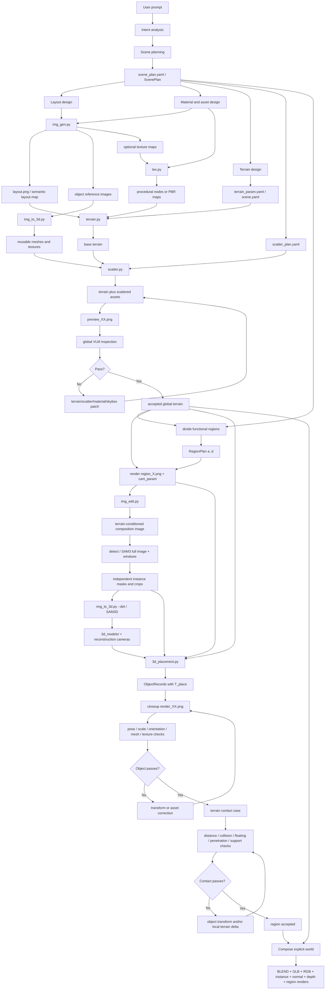

# WorldClaw Figures 1-3: Text and Workflow Extraction

Source images:

- [Figure 1 - pipeline](pipeline.jpg)
- [Figure 2 - terrain stages](terrain-stages.jpg)
- [Figure 3 - scene refinement](scene-refinement.jpg)

Source branch and commit: official `web` branch, `1b426ad5e865424d939b07804cf978738844aa26`.

## Reading rules

- **Quoted transcription** reproduces visible labels as closely as the source resolution allows.
- **Normalized name** converts a visual label into a proposed software artifact or function.
- Text ending in `...` is visibly truncated in the figure and must not be treated as a complete configuration.
- Numeric sampler values and loop counters are shown in an illustrative diagram. They are evidence of parameter types and bounded loops, not confirmed universal constants.
- The diagrams occasionally abbreviate or simplify the prose. Where they differ, the equations and body text remain authoritative.

## 1. Figure 1 - complete pipeline

### 1.1 User input

Visible prompt:

> Generate a cartoon-style snowy landscape featuring mountains flanking both sides and diverse terrain types.

### 1.2 Stage 1 - Intent Analysis & Planning

Visible extracted fields:

| Field | Visible value |
|---|---|
| Scene Type | `snow and ice` |
| Spatial Layout | `surround by mountain,` |
| Visual Style | `cartoon`, `NPR` |
| Main Objects | `tree, house, stone, fence, torch` |
| Terrain Categories | `forest, ice, snow, hill, road` |

Normalized output: `ScenePlan` / `scene_plan.yaml`.

The graph implies that the planning output is consumed by both global terrain generation and later regional design. It is therefore shared state, not a disposable prompt summary.

### 1.3 Stage 2.1 - Prompt Planning

The figure splits terrain planning into three blocks.

#### (a) Layout design

Visible text:

> ... a cold biome with frozen lake, forests, road path...

Normalized content:

- region/terrain categories;
- coarse spatial relationships;
- coverage and adjacency;
- water and path topology.

#### (b) Material & assets design

Visible text:

> forest: deep green-brown...
>
> road path: dark gray-brown...
>
> 3d assets: snow-covered tree, stone, ice, blue flame torch...

Normalized content:

- material descriptions per semantic terrain category;
- reusable environmental asset categories;
- appearance/style constraints for those assets.

#### (c) Terrain design

Visible text:

> frozen lake: hmap(x0, y0)...
>
> forests: hmap(x1, y1) + rise...
>
> road path: width(x2, y2) * p...

Normalized content:

- per-region height-map functions;
- additive landform terms such as `rise`;
- feature-specific functions such as path width;
- numeric parameters later serialized into `terrain_param.yaml`.

### 1.4 Stage 2.2 - Scene Assets Generation

#### `gen image`

Visible interface:

> prompt: `scene_plan.yaml`; script: `img_gen.py`

Visible outputs:

- `layout map`;
- `object images`;
- `texture map (optional)`.

Normalized edge:

```text
scene_plan.yaml -> img_gen.py -> layout.png
                              -> object_reference_images/
                              -> optional_texture_maps/
```

#### `3d gen`

Visible interface:

> script: `img_to_3d.py`

Visible graph:

```text
Image -> 3D Gen -> mesh & texture
```

The bottom of the panel shows reconstructed versions of the reference objects, confirming reusable asset prototypes rather than immediately placed instances.

#### `tex gen`

Visible interface:

> script: `tex.py`

Two visible branches:

- `a. proc texture`;
- `b. texture map`.

The procedural branch visibly connects texture controls to `BSDF` and then `Material`. This is consistent with a Blender node-graph material path. The alternative branch supplies an image texture map.

### 1.5 Stage 2.3 - Scene Terrain Generation & Refinement

#### `terrain generation`

Visible interface:

> script: `terrain.py`

Visible actions:

1. `read (filename: terrain_param.yaml)`;
2. `exec_py_src (script: import bpy ...)`.

Normalized edge:

```text
terrain_param.yaml + layout.png + materials
    -> terrain.py
    -> Blender Python execution
    -> base terrain scene
```

#### `3d assets scatter`

Visible interface:

> script: `scatter.py`

Visible actions:

1. `read (filename: scatter_plan.yaml)`;
2. `exec_py_src (script: import bpy ...)`.

Normalized edge:

```text
scatter_plan.yaml + reusable 3D prototypes + terrain analyses
    -> scatter.py
    -> Blender Python execution
    -> scattered terrain scene
```

#### Global `scene refinement`

Visible controller:

> post: `VLM model`

Visible loop state:

> `/loop (3/5)` `running...`

Visible actions:

1. `render (filename: preview_03.png)`;
2. `exec_py_src (script: import bpy ...)`.

Normalized loop:

```text
terrain scene -> preview_XX.png -> VLM inspection
             -> parameter/script correction -> Blender execution
             -> new preview -> pass or iteration budget
```

The visual sequence shows terrain-only, terrain-plus-scatter, and refined terrain outputs as separate saved states.

### 1.6 Stage 3.1 - Region Planning

Visible action:

> `divide regions`

The diagram overlays four rectangular local work areas on the semantic terrain map:

| ID | Visible functional name |
|---|---|
| a | Festival Plaza |
| b | Cabin Village |
| c | Supply Site |
| d | Fishing Village |

This graph distinguishes a functional work region from the underlying terrain categories. For example, a village region may include road, snow, forest, and hill pixels.

Normalized output:

```text
global semantic terrain + object requirements
    -> divide_regions
    -> RegionPlan[a, b, c, d]
       each with mask/bounds, role, objects, appearance, and camera targets
```

### 1.7 Stage 3.2 - Terrain-Aware Rendering

#### `region design`

Visible interface:

> script: `img_edit.py`

Visible actions:

1. `render (filename: region_b.png)`;
2. `exec_py_src (script: import ...)`.

Visible artifacts:

```text
render image -> composition image
```

Normalized edge:

```text
RegionPlan[b] + terrain camera + region_b.png
    -> img_edit.py / image-editing provider
    -> composition image preserving the terrain view
```

#### Regional `3d gen`

Visible interface:

> script: `img_to_3d.py --det`

Visible actions:

1. `detect (file_path: objects/)`;
2. `exec_py_src (script: import ...)`.

Visible artifacts:

```text
composition image -> detection -> 3d recon object list
```

The object list is illustrated as independent items (`obj 1`, `obj 2`, `obj 3`, `...`, `obj 50`), supporting the paper's instance-level reconstruction claim.

#### `place model`

Visible interface:

> script: `3d_placement.py`

Visible actions:

1. `read (file_path: 3d_models/ cam_param)`;
2. `exec_py_src (script: call placement skills)`.

Visible output:

> `placement determination`

The placement graphic includes the regional view frustum/camera symbols, reinforcing that object placement consumes camera parameters rather than only 2D bounding boxes.

Normalized edge:

```text
3d_models/ + instance masks/crops + cam_param + terrain mesh
    -> 3d_placement.py
    -> independent ObjectRecords with T_place
```

### 1.8 Stage 3.3 - Scene Refinement

Visible controller:

> `for ( ) in a b c d`

Visible loop state:

> `/loop (6/15)` `running...`

Visible steps:

1. `closeup render (filename: render_06.png)`;
2. `objects refine (current: object_07.glb)`;
3. object checks/controls:
   - `pose (t, r)`;
   - `scale (dim, s)`;
   - `quality (mesh, tex)`;
4. `terrain refine`;
5. terrain checks:
   - `collision (c, p)`;
   - `quality (mesh)`.

The exact meanings of abbreviations `t`, `r`, `dim`, `s`, `c`, and `p` are not defined in the figure. A reasonable working interpretation is translation/rotation, dimensions/scale, and collision/contact/penetration, but the implementation must use descriptive field names rather than copying the abbreviations.

Normalized loop:

```text
for region in selected_regions:
    render closeup
    for object in region queue:
        inspect pose, scale, mesh, texture
        correct and re-render
    inspect terrain contact/collision and mesh quality
    co-correct object/terrain and re-render
    stop on pass or regional budget
```

### 1.9 Final 3D Scene

Visible global outputs:

- `scene`;
- `normal`;
- `instance`.

Visible local outputs:

> `region render result`

The project website additionally publishes depth. Reproduction output should therefore include:

- RGB/scene;
- instance IDs;
- normals;
- metric depth;
- per-region closeup/walk views.

## 2. Figure 2 - terrain subgraph

### 2.1 Terrain generation inputs

Visible files:

- `scene.yaml`;
- `layout.png`.

Visible `scene.yaml` fields:

- `color map: ...`;
- `terrain params: ...`;
- `material type: ...`;
- `base envelop: ...` (the diagram uses `envelop`; normalized schema should use `base_envelope`).

### 2.2 Terrain basis functions

Visible `noise types`:

- `fBm`;
- `voronoi`;
- `gradient noise...`.

Visible `landform` operators:

- `peak`;
- `crater`;
- `dunes`;
- `terrace`;
- `erosion`.

Visible pseudocode:

```python
def **_terrain(c_i):
    mask = map[c_i]
    rise = float(...)
    pow = float(...)
    drop = float(...)
    ...
    field = rise + drop
```

`**` is a placeholder/wildcard in the illustration, not a valid function name. `c_i` is a terrain category/color index. The graph shows a material node group and palette connected to the resulting terrain.

Normalized subgraph:

```text
scene.yaml + layout.png
    -> category mask map[c_i]
    -> base envelope
    -> noise basis + landform operators
    -> per-category field (rise + drop + other terms)
    -> semantic-weight blend
    -> terrain mesh + regional material blend
```

### 2.3 3D asset scattering

The graph depicts three asset prototypes (`a`, `b`, `c`) and per-prototype sampler settings.

Visible example settings:

```yaml
a:
  sampler: position
  dis_min: 1.8
  den_max: 1.2
b:
  sampler: random
  den: 1.4
c:
  sampler: position
  dis_min: 0.5
  den_max: 11
```

The labels `den_max` are visually small; they should be verified against author code if it becomes available. No units are shown. Preserve these as transcription evidence, not production defaults.

Normalized subgraph:

```text
prototype + semantic region affinity + sampler config
    -> candidate positions
    -> distance/density constraint
    -> terrain elevation/slope/normal adaptation
    -> instance transforms
```

### 2.4 Terrain refinement parameter groups

Visible groups and fields:

| Group | Visible fields |
|---|---|
| `params` | `warp, amplitude, density, slope...` |
| `scatter` | `density, radius, scale, sampler...` |
| `material` | `coord, color, roughness...` |
| `skybox` | `azimuth, elevation, strength, color...` |

Normalized patch graph:

```text
diagnostic render + metrics/VLM report
    -> choose one or more typed patch groups
       -> terrain shape patch
       -> scatter patch
       -> material patch
       -> skybox/lighting patch
    -> rebuild affected layers only
    -> re-render and compare
```

## 3. Figure 3 - refinement subgraphs

### 3.1 Object refinement

Initial log:

```text
log (object)
Processing <- obj 1
Pending    <- obj 2
render.png
```

Visible object attributes:

- `semantic category`;
- `geometric property`;
- `zoom-in view ...`.

Visible region attributes:

- `region design`;
- `object composition`;
- `scene concept ...`.

Visible pseudocode:

```python
def object_refine(o_i):
    pose = float(o_i.pose)
    size = float(o_i.Size)
    orient = float(o_i.orient)
    ...
    status = object_check(...)
```

Visible check result:

```text
PASS Pose, Mesh quality
FAIL Scale (too large) -> refining...
```

Final log:

```text
log (object)
Success <- obj 1
Pending <- obj 2
re-render.png
```

Normalized state flow:

```text
PENDING
  -> PROCESSING
  -> load object attributes + region context + render.png
  -> object_check(pose, scale, orientation, mesh, texture)
     -> PASS -> re-render -> SUCCESS
     -> FAIL -> typed transform/mesh/texture correction -> re-render -> PROCESSING
     -> budget exhausted -> FAILED_BUDGET
```

### 3.2 Terrain/contact refinement

Initial log:

```text
log (terrain)
Processing <- case 1
Pending    <- case 2
render.png
```

Visible pseudocode:

```python
def terrain_refine(o_j, t):
    terrain_mesh = t
    contact_object_mesh = o_j
    distance = compute(o_j, t)
    ...
    status = terrain_check(...)
```

Visible check result:

```text
PASS Mesh quality
FAIL Collision (suspension) -> refining...
```

Here `suspension` visually represents an object floating above its support surface, not a vehicle suspension system.

Final log:

```text
log (terrain)
Success <- case 1
Pending <- case 2
re-render.png
```

Normalized state flow:

```text
PENDING
  -> PROCESSING
  -> load terrain mesh + contact object mesh + render.png
  -> compute distance/contact/collision/support metrics
  -> terrain_check(mesh quality, collision, floating, penetration, support)
     -> PASS -> re-render -> SUCCESS
     -> FAIL -> object transform and/or local terrain delta -> re-render -> PROCESSING
     -> budget exhausted -> FAILED_BUDGET
```

Dependency:

```text
object refinement SUCCESS
    -> create or release terrain-contact case
    -> terrain refinement
```

This ordering is explicitly stated in the paper prose and visually reinforced by the two Figure 3 panels.

## 4. Consolidated workflow graph



## 5. Workflow contracts extracted from the graphs

The visual flow implies these minimum contracts:

1. Planning must serialize reusable file-backed state; later stages do not operate directly on the raw prompt.
2. Layout, object references, textures, meshes, terrain parameters, scatter parameters, and camera parameters are separate artifacts.
3. Terrain generation and asset scattering are separate Blender executions.
4. Global terrain refinement finishes before functional regions are populated.
5. Regional composition begins from an actual terrain render with recorded camera parameters.
6. Detection/reconstruction yields an independent object list, not a monolithic regional mesh.
7. Placement explicitly reads both 3D models and camera parameters.
8. Regional refinement iterates over regions and over queued objects/cases.
9. Object refinement and terrain-contact refinement have distinct logs, inputs, checks, and completion states.
10. Every refinement decision is verified by a new render.
11. Final output includes global diagnostic channels and per-region views.
